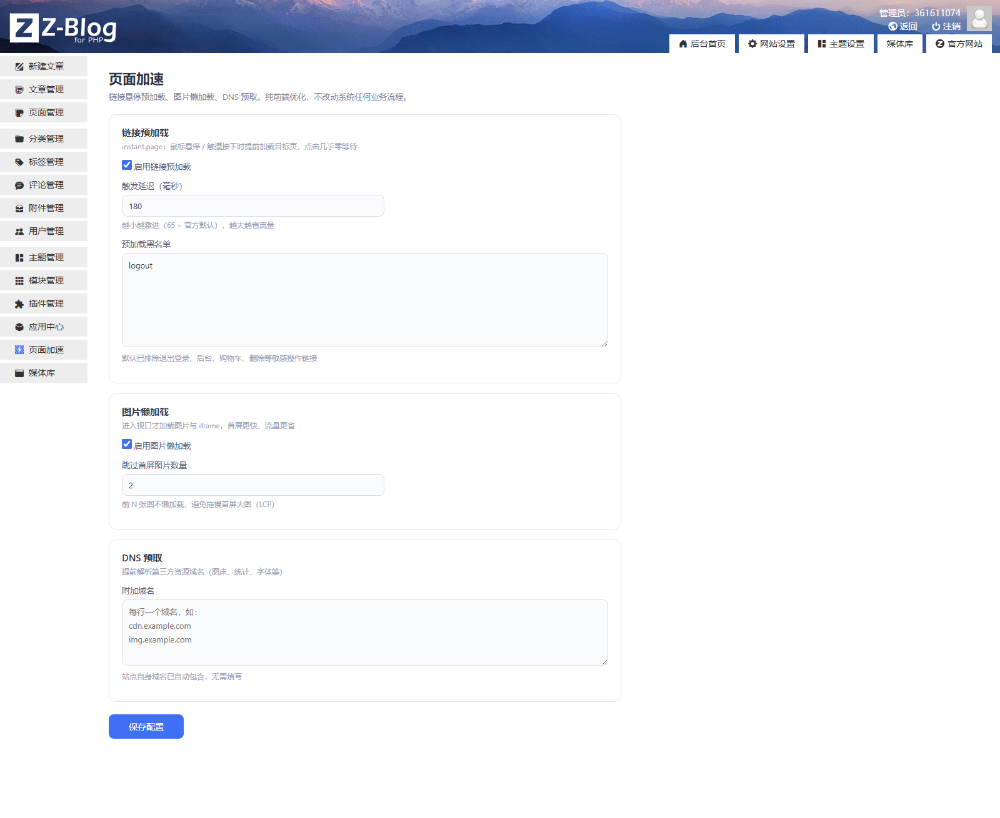
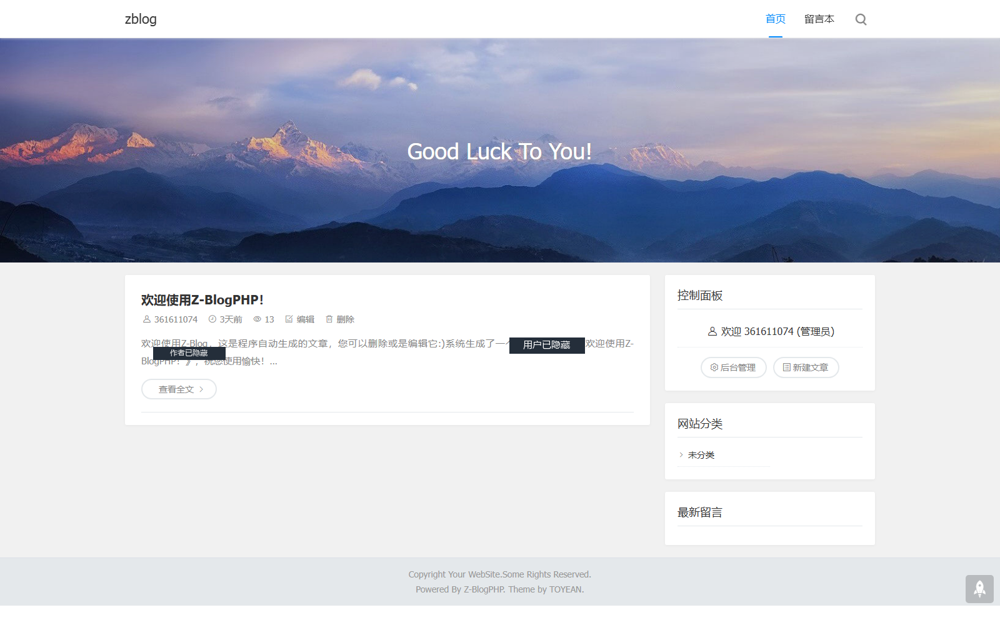
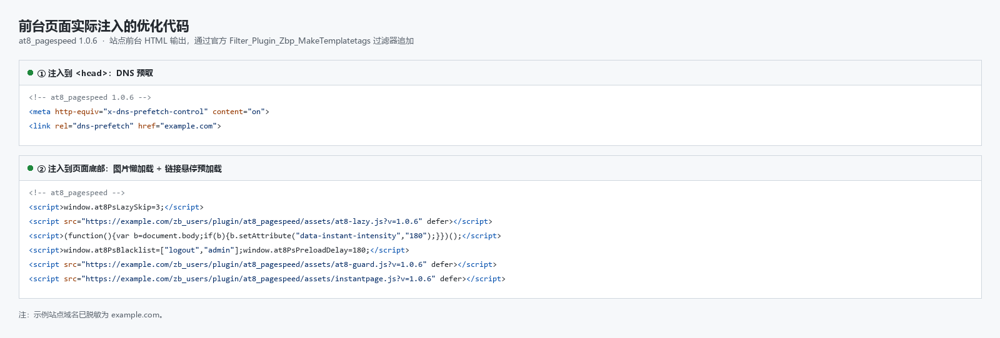

# at8_pagespeed · 页面加速（Z-BlogPHP）

链接悬停预加载、图片懒加载、DNS 预取——三合一页面访问加速插件。

**纯前端输出层优化**：只通过 Z-BlogPHP 官方输出过滤器 `Filter_Plugin_Zbp_MakeTemplatetags`（1.7.x 前台唯一注入点，引用传递 `$tags`，追加 `$tags['header']` / `$tags['footer']`）注入资源，**不接管、不修改系统任何业务流程**（上传 / 删除 / 发布 / 评论等一概不碰），对其他插件与站点数据零侵入。

## 功能

### 1. 链接预加载（instant.page v5.2.0 内置）

- 鼠标悬停 / 触摸按下时提前预取目标页，点击几乎零等待；
- 触发延迟可调（默认 65ms，越大越省流量，0 最激进）；
- **敏感链接黑名单**：链接地址含关键字即跳过预加载（默认已排除退出登录、后台、购物车、支付、删除、编辑、feed 等），支持后台自定义、MutationObserver 兜底动态链接。

### 2. 图片 / iframe 懒加载

- 视口外资源补 `loading="lazy"` + `decoding="async"`；
- 可设置跳过首屏前 N 张图，避免拖慢 LCP；
- 支持 `data-no-lazy` 属性排除单个元素或容器。

### 3. DNS 预取

- 站点自身域名自动包含；
- 后台可添加第三方资源域名（图床 / 统计 / 字体），自动过滤非法格式。

## 界面预览

**后台设置页** —— 接入 Z-BlogPHP 官方后台框架，左侧菜单与顶栏为系统原生：

**前台页面** —— 优化在输出层完成，前台外观与主题原样一致：

**实际注入的优化代码** —— 加速插件前台没有可见 UI，以下是页面源码中真实生成的片段（`<head>` 内 DNS 预取、页面底部懒加载与预加载）：

## 兼容性

- Z-BlogPHP 1.7+（MySQL / SQLite / PostgreSQL 均可，仅使用标准配置存取）；
- 任何前台主题（`$header` / `$footer` 为官方标准模板变量）；
- 后台页面、登录页、接口请求自动跳过注入。

## 安装

1. 应用中心搜索「页面加速」或上传 zba 包安装；
2. 后台左侧菜单「页面加速」进入设置；
3. 各功能独立开关，默认开启预加载与懒加载。

## 生命周期与数据

| 阶段 | 行为 |
|---|---|
| 安装 | 幂等写入默认配置（仅补齐缺失键，不覆盖用户已保存的值） |
| 启用 | 仅注册两个官方过滤器（输出注入 + 后台菜单），无其他副作用 |
| 停用 | 不修改任何数据，前台注入随之停止 |
| 升级 | `UpdatePlugin_at8_pagespeed()` 按 `ConfigVer` 逐级迁移，不重建数据 |
| 卸载 | 删除本插件配置（`zbp_config` 中 `conf_Name = at8_pagespeed`）；本插件不建表、不写文件，无其他残留 |

## 安全与合规

- 不建表、不修改系统文件、不接管任何系统 Hook 业务流程；
- 配置写操作 `CheckIsRefererValid()` 校验（官方写操作标准姿势，失败直接终止），后台页 `admin` 权限；
- 前台输出全部 `htmlspecialchars` 转义，DNS 域名白名单格式校验（非法格式丢弃）；
- 后台/登录页/接口请求自动跳过注入（判定依据：`$zbp->ismanage` 与 `/zb_system/` 请求路径，均为官方原生机制）；
- 无加密、无混淆、无外站资源引用（instant.page 与懒加载脚本均内置本地），不写任何敏感信息到页面或日志；
- 不读取 `HTTP_REFERER` 做跳转（避免伪造跳转与直接访问时的未定义索引告警），保存后固定回设置页。

## 更新日志

### 1.0.3（2026-09-23）

- 修正 `plugin.xml` 中 `<source>` 的来源名称残留（原值与作者标识不一致，已改为「漫步白月光」）；
- 补充 `screenshots/` 上架截图（后台设置页 / 前台页面 / 前台注入的优化代码）。

### 1.0.2（2026-09-23）

- **修复设置页丢失左侧菜单**：`main.php` 原先自行输出整页 HTML（`doctype` / `html` / `head` / `body`），脱离后台整体框架；现改用官方 `admin_header.php` + `admin_top.php` + `admin_footer.php`，与其它后台页面一致；
- 移除页面内重复的 `$zbp->GetHint()`（官方框架已统一输出）。

### 1.0.1（2026-09-23）

- 修正源码注释与 README 中对注入口 Hook 的错误描述（虚构的 `Filter_Plugin_Zbp_Header/Footer` → 实际存在的 `Filter_Plugin_Zbp_MakeTemplatetags`）；
- 移除对未定义常量 `ZBP_IN_ADMIN` 的判定（1.7.5 不存在该常量），改为 `$zbp->ismanage` + 请求路径双保险；
- 保存配置后不再使用 `$_SERVER['HTTP_REFERER']` 跳转（开放重定向风险 + 直接 POST 时未定义索引告警），固定回设置页；
- 安装改为幂等（仅补齐缺失配置键），新增 `UpdatePlugin_at8_pagespeed()` 升级迁移入口；
- 设置页 `lang` 属性输出转义；`plugin.xml` 补充 `<description>` 元数据。

### 1.0.0（2026-09-23）

- 首个版本：链接悬停预加载（instant.page v5.2.0）、敏感链接黑名单、图片/iframe 懒加载、DNS 预取。

## 相关链接

- 开发者：漫步白月光 · https://www.at8.fun/
- 用户交流 QQ 群：985368092
- 许可：本插件 MIT；内置 instant.page v5.2.0 © Alexandre Dieulot（保留其原始许可头）
